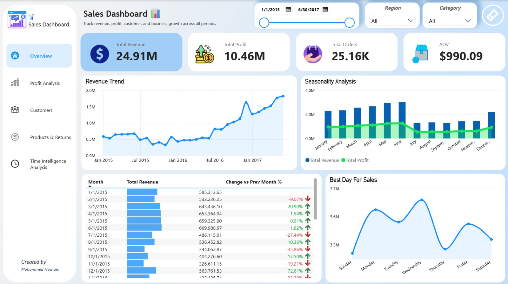
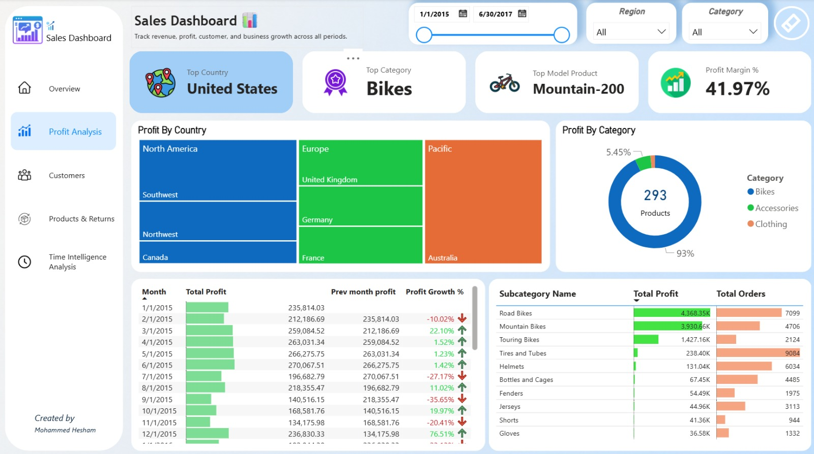
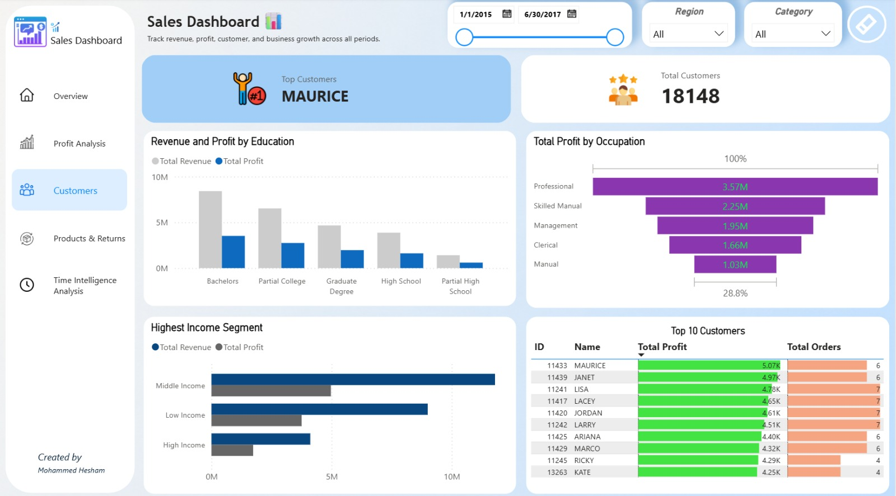
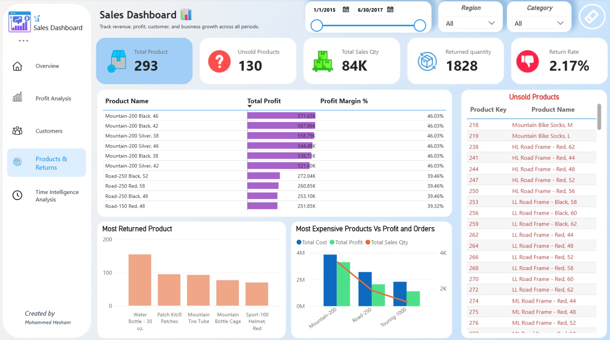
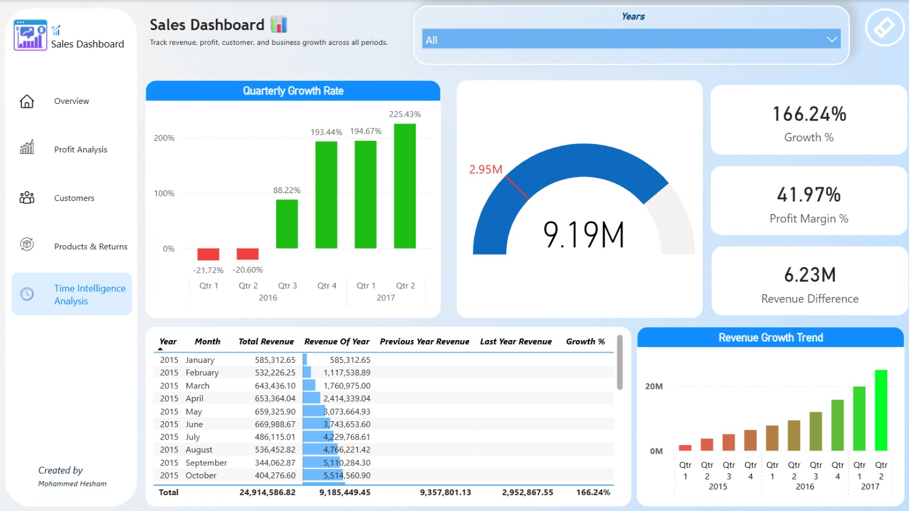

# 📊 Business Performance Analytics Dashboard

## 📌 Project Overview

This project analyzes sales performance, profitability, customer behavior, product performance, returns, and business growth using Power BI.

The dashboard provides interactive insights through multiple report pages, helping stakeholders monitor KPIs, identify growth opportunities, and support data-driven decision-making.

---

## 🛠️ Tools & Technologies

- Power BI
- DAX
- Power Query
- Data Modeling

---

## 📈 Dashboard Overview

### Key Metrics

- Total Revenue: $24.91M
- Total Profit: $10.46M
- Total Orders: 25.16K
- Profit Margin: 41.97%
- Return Rate: 2.17%

---

## 📷 Dashboard Pages

### Overview

### Profit Analysis

### Customer Analysis

### Products & Returns

### Time Intelligence Analysis

---

## ⏱️ Time Intelligence Metrics

- YTD Revenue (Year-To-Date Revenue)
- LYTD Revenue (Last Year-To-Date Revenue)
- Previous Year Revenue (Same Month In Previous Year)
- YoY Growth % (Annual Growth)

---

## 🔍 Key Insights

### Revenue & Sales

- Revenue grew steadily from approximately **$585K per month in early 2015 to over $1.8M by mid-2017**.
- The business experienced a slowdown during the first half of 2016 but recovered strongly in the second half of the year.
- May and June generated the highest revenue and profit levels.
- Wednesday was the best-performing sales day.

### Profit Analysis

- Bikes contributed the largest share of total profit.
- Road Bikes and Mountain Bikes were the strongest profit-generating product groups.
- Tires & Tubes generated high order volume but relatively low profit.
- The business maintained a healthy Profit Margin of **41.97%**.

### Customer Analysis

- Customers with Bachelor's Degrees generated the highest revenue and profit.
- Middle-Income customers contributed more revenue and profit than High-Income customers.
- Professional occupations generated the highest profit.
- Maurice was identified as the most profitable customer.

### Products & Returns

- Mountain-200 was the best-performing product line.
- Water Bottle - 30 oz. recorded the highest return quantity.
- 130 products generated no sales during the analysis period.
- Return Rate remained low at **2.17%**.

### Regional Performance

- The United States was the strongest-performing market.
- Canada generated the lowest profit among major countries.
- The Central region in the United States recorded the weakest performance, generating only **$3.1K revenue from 8 customers and 9 orders**.

### Time Intelligence

- Revenue continued to grow year-over-year throughout the analysis period.
- A strong recovery occurred during the second half of 2016 after negative growth in the first half.
- YoY Growth reached **166.24%**.
- LTD Revenue showed continuous long-term growth.

---

## 💡 Business Recommendations

1. Increase marketing efforts during May and June to maximize seasonal demand.
2. Focus on Road Bikes, Mountain Bikes, and Mountain-200 products.
3. Investigate the high return volume of Water Bottle - 30 oz.
4. Review the 130 unsold products and optimize inventory management.
5. Target Middle-Income customers through marketing campaigns.
6. Improve market in the Central region In USA Country.

---

## 👨‍💻 Author

**Mohammed Hesham**
Data Analyst | Power BI | Business Intelligence
